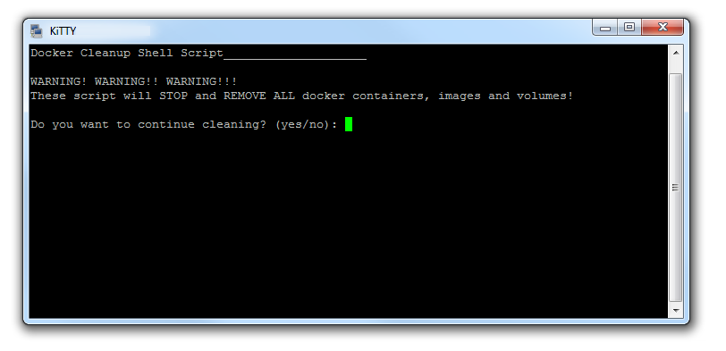

# Docker cleanup shell script
**WARNING!**    
**This shell script will stop and delete all docker containers, images and volumes on your host!**    
**It will not be possible to restore them!**  

## Usage 
Just execute following command in your Terminal (review [the script](https://raw.githubusercontent.com/nsotnikov/cleanup-docker/master/cleanup-docker.sh)):
```sh
sh <(curl -sL https://git.io/vDSx7)
```
This shell script will do:
  - stop and delete all docker containter
  - delete all images 
  - remove all docker volumes 

<p align="center">

</p>

## Authors

 Nikolaj Sotnikov - *Initial work*- [nsotnikov](https://github.com/nsotnikov)

## License

This project is licensed under the MIT License - see the [LICENSE](LICENSE) file for details
